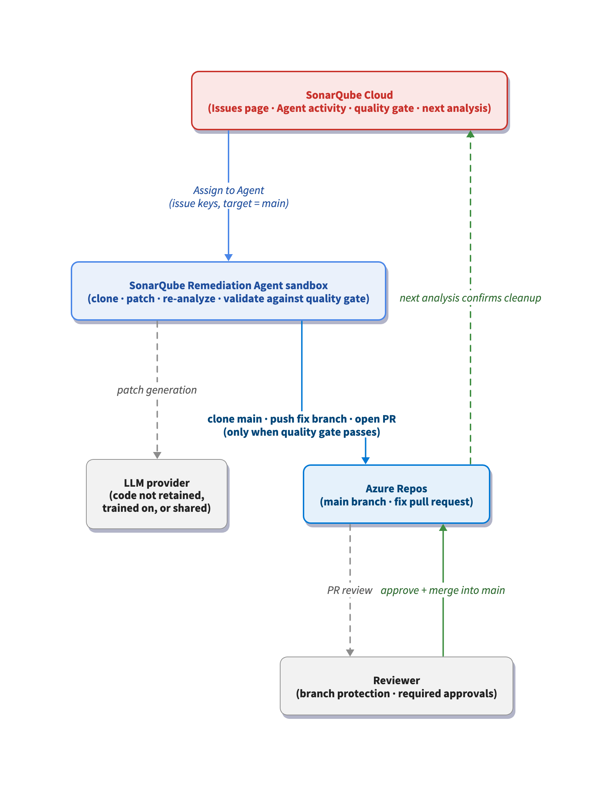

# Fix backlog issues with the SonarQube Remediation Agent on Azure DevOps

> Last verified: June 2026

## TL;DR overview

- The SonarQube Remediation Agent on Azure DevOps converts main-branch issue backlog cleanup in SonarQube Cloud into a review-and-merge task by generating validated fix pull requests in Azure Repos.  
- Reach for this when an Azure DevOps project has accumulated a long tail of Java, JavaScript, TypeScript, Python, C\# or secrets-rule issues on its main branch that the team has neither time nor context to remediate by hand.  
- Backlog issues that sit untouched compound into long-term maintainability and security debt; the agent works through them in parallel, leaves a complete audit trail on the Agent activity page, and keeps engineers focused on net-new code.  
- From the SonarQube Cloud Issues page, select issues on the main branch and choose Assign to Agent. The agent fixes the code inside a sandbox, validates against the project's quality gate, and opens a fix PR in the connected Azure DevOps repository for human review.

For teams analyzing their code with [SonarQube](https://www.sonarsource.com/products/sonarqube/), long-lived projects eventually accumulate a backlog of issues on their main branch. These issues are at times urgent, yet still require time and context to properly remediate. The [SonarQube Remediation Agent](https://www.sonarsource.com/products/sonarqube/remediation-agent/)—Sonar's *Solve* pillar in the [Agent Centric Development Cycle (AC/DC)](https://www.sonarsource.com/agent-centric-development/)—is built to absorb that burden. It's now enabled for repositories hosted in [Azure DevOps](https://www.sonarsource.com/integrations/azure/), which means ADO-based teams can finally sic an agent on their backlog instead of triaging it sprint-by-sprint. This blueprint walks through that end-to-end flow with a small [Python](https://www.sonarsource.com/knowledge/languages/python/) project hosted in Azure Repos.

## When to use this

- Your team's code lives in Azure Repos and your project has been analyzed by [SonarQube Cloud](https://www.sonarsource.com/products/sonarqube/cloud/).  
- A non-trivial number of open issues and/or secrets rules sit on `main` in your [Java](https://www.sonarsource.com/knowledge/languages/java/), [JavaScript](https://www.sonarsource.com/knowledge/languages/js/), [TypeScript](https://www.sonarsource.com/knowledge/languages/ts/), [Python](https://www.sonarsource.com/knowledge/languages/python/), or [C\#](https://www.sonarsource.com/knowledge/languages/csharp/) projects.   
- You want automatic backlog cleanup on the same review-and-merge rails as normal code changes, without bypassing required reviewers, branch protection, or quality gates.

## What you'll achieve

- Backlog issues from the SonarQube Cloud **Issues** page assigned to the Remediation Agent on the `main` branch of an Azure Repos project, with the agent's session visible on the **Agent activity** page.  
- A validated fix PR in Azure Repos targeting `main`, listing the resolved issue rule keys in its description, with the project's quality gate passing.  
- Remediated issue keys removed from the backlog and the agent's session retained as an audit trail in SonarQube Cloud.

## Architecture

When you assign issues to the Remediation Agent from SonarQube Cloud, the request flows into an isolated sandbox the agent owns. The sandbox clones the bound Azure Repos repository, sends the affected code snippet to an LLM to generate a fix suggestion for each supported rule, applies the suggested patch, and runs [SonarQube Agentic Analysis](https://www.sonarsource.com/products/sonarqube/agentic-analysis/) (SQAA) against the patched code to evaluate whether it will clear the project's quality gate. Per Sonar's service agreements with its LLM provider, the snippets sent for fix generation are never retained by the provider, used to train its models, or shared with any third party. Once SQAA's pre-commit check is satisfied, the agent pushes a new branch into Azure Repos and opens a PR back into `main`. The project's quality gate also evaluates the resulting PR, giving you a final, authoritative pass on the fix before merge. The agent leaves the PR open for you to review, adjust, and merge on your terms. The session itself is recorded on the **Agent activity** page in SonarQube Cloud, which gives you a per-run audit trail with status, duration, and submission timestamps.

## Prerequisites

- An Azure DevOps organization with an Azure Repos repository, already bound to your SonarQube Cloud organization. See [Getting started with Azure DevOps](https://docs.sonarsource.com/sonarqube-cloud/getting-started/azure-devops) for the import flow.  
- An Azure DevOps Personal Access Token with **Code (Read & write)** and **Analytics (Read)** scopes, the same PAT you used during the SonarQube Cloud Azure DevOps import.  
- A SonarQube Cloud project on a [**Team (annual)** or **Enterprise** plan](https://www.sonarsource.com/plans-and-pricing/).  
- The SonarQube Remediation Agent enabled on the SonarQube Cloud project under **Administration → AI capabilities → AI agent**, with backlog fixes (manual and/or automated) toggled on.  
- An analyzed `main` branch with at least one open issue in Java, JavaScript, TypeScript, Python, C\#, or a matching secrets rule.  
- A SonarQube Cloud user with permission to assign issues to the Remediation Agent on the project.

The step-by-step walkthrough below follows a small Python project hosted in Azure Repos and analyzed by SonarQube Cloud. It carries numerous open Python issues on `main`,  three of which we'll assign to the Remediation Agent in a single batch.

### Step 1 — Identify issues on the main branch

Open SonarQube Cloud and navigate to the **Issues** tab of your project. Confirm the branch selector reads `main`, as backlog assignments only operate against the main branch and any filtering on feature branches won't surface the right candidates.

Filter to supported languages and the rule families the agent can act on. Issues in unsupported languages are visible here, but they won't be eligible for assignment.

### Step 2 — Assign issues to the Remediation Agent

Select the checkboxes for the issues you want the agent to handle. In our example, that's three issues on `src/antipode.py`:

- `python:S1172` on line 21 — Remove the unused function parameter `wrap`.  
- `python:S5717` on line 70 — Change this default value to `None` and initialize this parameter inside the function/method.  
- `python:S5754` on line 131 — Specify an exception class to catch or reraise the exception.

Click **Assign to Agent** in the toolbar. Note that this button only applies to issues that are *fixable* by the agent; if you use the **Fixable by Agent** filter on the left-hand side of the **Issues** tab, it will only display issues that the agent can handle.

### Step 3 — Monitor the agent session

Navigate to the **Agent activity** page for the project. You'll see a row for the session you just submitted, with the status moving from **Pending** to **Running** and finally to **Completed**. Each row shows duration, submission timestamp, and a **Source** of backlog fixes so you can tell manual backlog remediation assignment apart from automatic (scheduled) runs.

During the run, the agent is doing its sandboxed work: cloning the repo, applying patches per rule, and re-analyzing the patched code against the project's quality gate. You don't need to do anything here. If the run fails (usually because a fix would regress the quality gate) the row records the failure and no PR is opened.

### Step 4 — Review and merge the fix PR in Azure Repos

Click on **PR \#1** in the **Outcome** column to navigate directly to the PR, or switch over to Azure DevOps and open **Repos → Pull Requests** on the bound repository. The agent's pull request will be sitting in the active list under a branch name that follows the pattern `remediate-main-<timestamp>-<hash>`. In our example, that branch is `remediate-main-20260611-203418-7b8ad4d0`.

The agent grouped all three fixes into a **single pull request** against `main`, even though they hit three different rule keys. These were bundled into a single PR because we selected three issues and assigned them to the agent on a single run. Note, however, that assigning the agent multiple issues at a time won't necessarily result in a single PR; depending on the size and complexity of the fixes, the agent could generate one or multiple PRs.

The PR description is the agent's own writeup of what changed and why:

This PR was created because a team member assigned these issues to the Remediation Agent.

Resolves three critical SonarQube issues: removes an unused function parameter, replaces mutable default arguments with None to prevent shared state bugs across function calls, and replaces bare except clauses with specific ValueError handling to allow critical system exceptions to propagate properly. These changes improve code reliability and prevent subtle bugs related to exception handling and mutable defaults.

Underneath, the **Fixed Issues** block lists each rule key, severity, and source location, so a reviewer can trace each line of the diff back to the rule that triggered it.

| Issue | Rule | Fix applied |
| :---- | :---- | :---- |
| Remove the unused function parameter `wrap` | `python:S1172` (High) | Deleted `wrap` from the parameter list of `calculate_antipode_v2` in `src/antipode.py` |
| Change default value to `None` and initialize inside the function | `python:S5717` (Medium) | Replaced `results=[]` with `results=None` and added a lazy initialization inside `batch_antipodes` |
| Specify an exception class to catch or reraise | `python:S5754` (Medium) | Replaced the bare `except:` in `load_coordinates_from_file` with `except ValueError:` |

We can also examine the fix at the code level, before and after.

The PR shows a passing quality gate check, which is the same gate the agent validated against in its sandbox before opening the PR in the first place. Once your project's required reviewers approve, click **Complete** to merge. Branch protection rules apply to the agent's PR exactly the same way they apply to a human-generated PR; required reviewers, required builds, and merge strategy are all enforced.

### Step 5 — Verify the fixes on the next analysis

After the next analysis runs on `main` (either through automatic analysis or your CI pipeline) return to the SonarQube Cloud **Issues** tab. The rule keys you assigned to the Remediation Agent should be gone from the open issues list. In our project, all three issues are removed from `src/antipode.py` and the project’s overall issue count was reduced from 32 to 29\.  

### Step 6 — (Optional) automate backlog remediation

In addition to handling backlog remediation manually, the Remediation Agent can also tackle your issues backlog on a scheduled basis. Automating backlog remediation can help to further alleviate the burden of issues resolution. From your project dashboard on SonarQube Cloud, navigate to **Administration → AI capabilities → AI agent** and toggle-on **Automated backlog remediation**. Select the project scope (**All projects** or **Only selected project**) and configure the **Run schedule** (**Daily** or **Weekly**, **Day**, **Time**, and **Timezone**). You can also select whether to **Pause when open PRs reach** a particular number (user defined); in this case, the agent pauses creating new PRs when this number is reached, but existing PRs from other sources are not counted. Conversely, select **Don’t pause** to opt out of this feature. 

## What to know

- At this time, backlog assignments only operate against `main`, and the resulting PRs target `main` as well.   
- Supported scope is Java, JavaScript, TypeScript, Python, C\#, and secrets rules. Issues outside that scope stay in the backlog regardless of severity. Check the SonarQube Remediation Agent [documentation](https://docs.sonarsource.com/agent-centric-development-cycle/how-to-guides/administer-ac-dc-features/remediation-agent) for the up-to-date unsupported-rules list before assigning issues at scale.  
- Sonar's service agreement prevents the LLM provider from training on, storing, or sharing the code the agent sees during a session. Worth knowing before you point the agent at a private repository.  
- The Remediation Agent can also fix dependency vulnerabilities found by Software Composition Analysis (SCA).  
- Azure DevOps branch protection (required reviewers, build validation, merge strategy) applies to the agent's PRs the same way it applies to human PRs. The agent doesn't bypass review, and it doesn't need a separate exception.  
- Azure DevOps PR descriptions have a strict 4,000-character limit. If the PR contains a small number of issues, it will show the full, detailed issue descriptions. Otherwise, only the rule and some metadata related to the issues are displayed, and the rest of the details are truncated.

## Next steps

- If you haven’t already, get started with [Azure DevOps on SonarQube Cloud](https://docs.sonarsource.com/sonarqube-cloud/getting-started/azure-devops)  
- Fix backlog issues with the [SonarQube Remediation Agent on GitHub](https://www.sonarsource.com/resources/library/fix-backlog-issues-with-the-sonarqube-remediation-agent/)  
- Consult the SonarQube Remediation Agent [official docs](https://docs.sonarsource.com/agent-centric-development-cycle/solve/solve-issues/administer-remediation-agent)  
- Connect the Guide, Verify, Solve dots with Sonar's [Agent Centric Development Cycle](https://www.sonarsource.com/agent-centric-development/) framing
